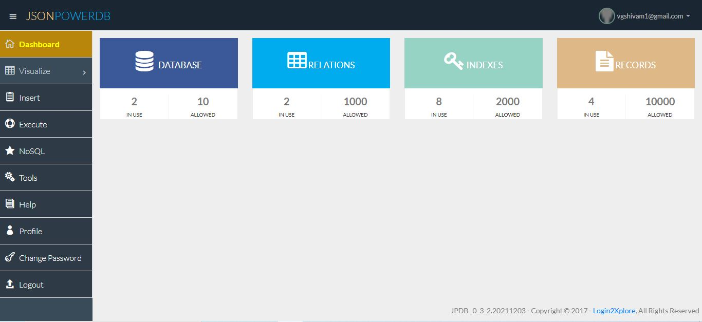
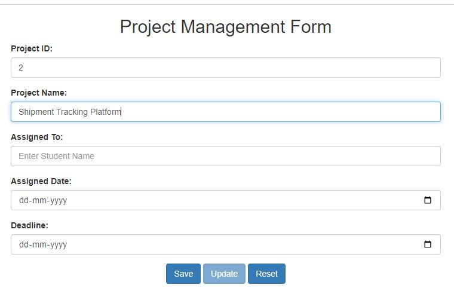
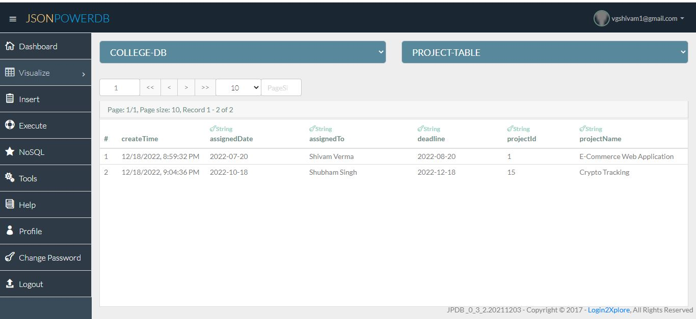

# JsonPowerDB
JsonPowerDB is a Real-time, High Performance, Lightweight and Simple to Use, Rest API based Multi-mode DBMS. JsonPowerDB has ready to use API for Json document DB, RDBMS, Key-value DB, GeoSpatial DB and Time Series DB functionality. JPDB supports and advocates for true serverless and pluggable API development.
 
 
[Documentation Link](https://login2explore.com/jpdb/docs.html)

# Project Title
### Project Management Form using JsonPoweredDB API

## Description

In this Micro Project a form for project management is created using JPDB. And This form stores data in the JPDB database.
There are three control buttons [Save], [Update] and [Reset] at the bottom of the form. On page load or any control button click, an empty form is being displayed and the cursor will remain at the first input field in the form which is having the primary key in the relation. All other fields and buttons are disabled at this time.

User will enter data in the field having primary key and-

If the **primary key value does NOT exist** in the database, [Save] and [Reset] buttons are enabled and cursor is moved to the next field and the user is allowed to enter data in the form.

On successfull submission of form, form is reset to initial.

If the **primary key value is present** in the database, then available data is displayed in the form. And [Update] and [Reset] buttons are enabled and the cursor is moved to the next field in the form.

## Features of JsonPowerDB

- Nimble, simple to use, in memory, real time
- Schema free - easy to maintain
- Serverless support - fast development - cuts time to market
- Built around the world's fastest indexing engine PowerIndex
- Webservices API - Low Dev Cost
- Multiple Security Layers
- A single instance - Million Indexes
- Inbuilt support for querying multiple databases
- Serverside Native NoSQL - best performance
- Multi-mode database - One solution to a variety of data

## Screenshots

- **Dashboard**

- **Form**

- **Database Visualization**

